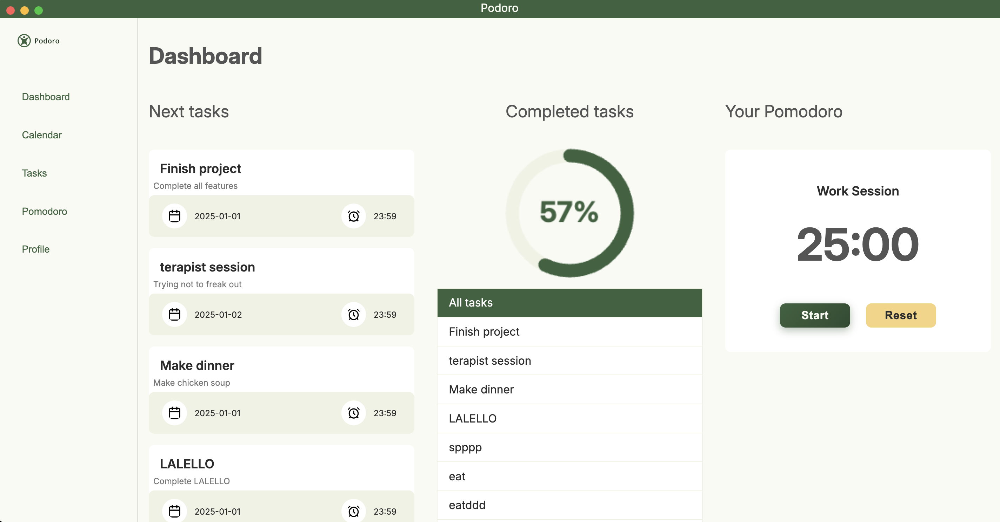
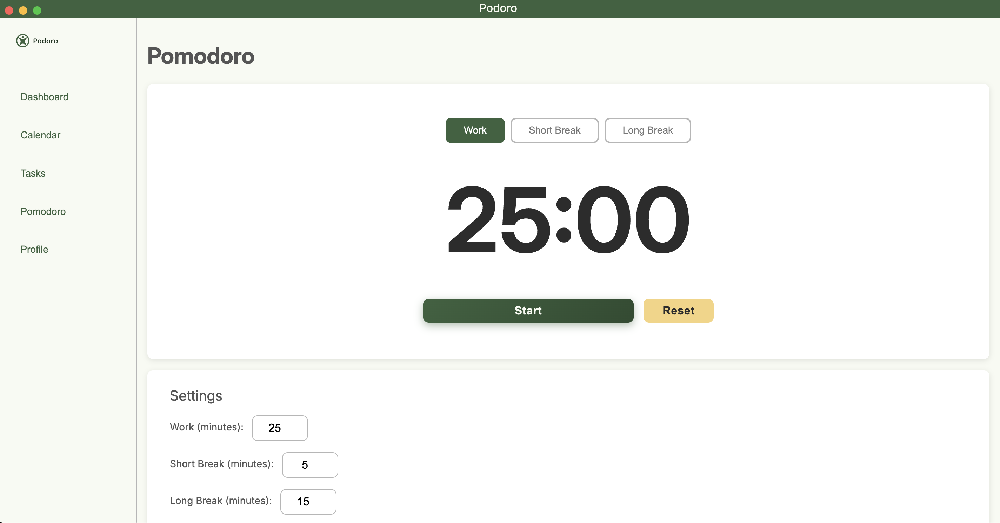
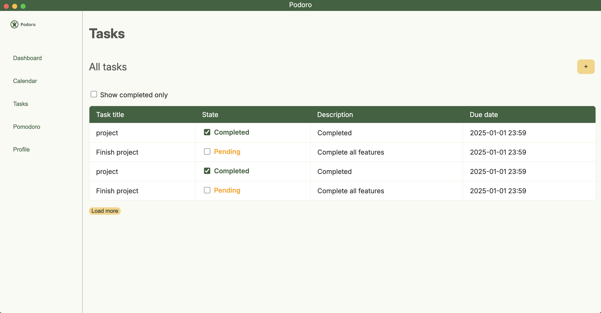
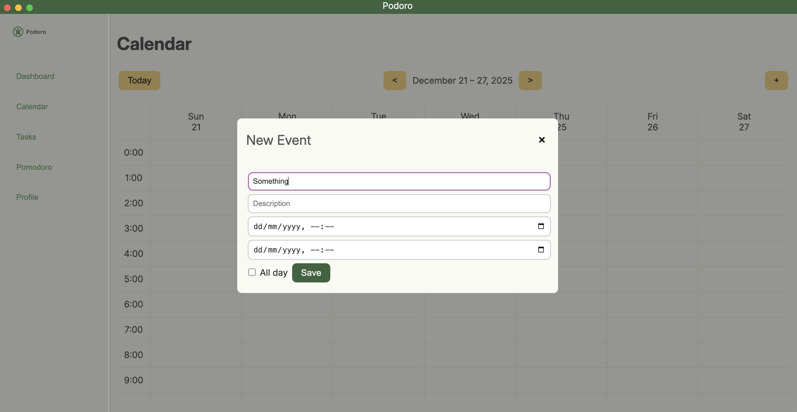
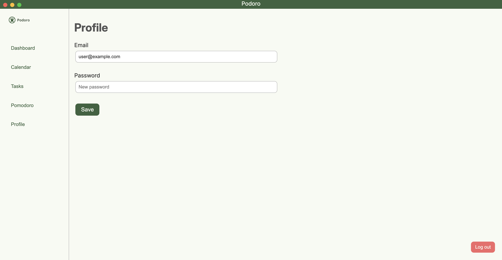

## Project Description

Pomodoro productivity app with tasks, calendar events, a dashboard with insights, and a simple Electron desktop client backed by a Node.js + MongoDB API.








## Prerequisites

- Node.js and npm — verify with `node -v` and `npm -v`
- MongoDB Community Server (local instance)
  - macOS (Homebrew):
    ```bash
    brew tap mongodb/brew
    brew install mongodb-community@7.0
    brew services start mongodb-community@7.0
    ```
  - Windows / Linux: install MongoDB Community from the official packages or your package manager.

## Install

1. Clone the repository and open the project root (where `package.json` is located).
2. Install dependencies:

```bash
npm install
```

The main dependencies are `electron` and `mongodb` (used by the server).

## Configuration

- Copy [client/config.example.js](client/config.example.js) to [client/config.js](client/config.js).
- Set `isDevelopment` according to where the API lives:
  - `true` → local API at `http://localhost:8080`
  - `false` → live server at `http://10.17.0.28:8080`need to use DEI wifi or VPN to work

# Start MongoDB (before seeding)

Make sure a MongoDB server is running on `localhost:27017` before importing the seed files.

- Windows (if installed as a service):

```powershell
net start MongoDB
# or run 'mongod'
```

## Seed the database

Seed data files are in the `seed-data/` folder. To import them into a local MongoDB database named `pomodoro_app`, use `mongoimport` (part of MongoDB tools):

```bash
# Import users
mongoimport --db pomodoro_app --collection users --file seed-data/pomodoro_app.users.json --jsonArray

# Import tasks
mongoimport --db pomodoro_app --collection tasks --file seed-data/pomodoro_app.tasks.json --jsonArray

# Import pomodoro sessions
mongoimport --db pomodoro_app --collection pomodoro_sessions --file seed-data/pomodoro_app.events.json --jsonArray

# Import events
mongoimport --db pomodoro_app --collection events --file seed-data/pomodoro_app.events.json --jsonArray
```

By default the server connects to `mongodb://localhost:27017` and uses the `pomodoro_app` database.
 
## Run

The application can run in two modes: **Electron (Desktop)** or **Web Browser**.

### Prerequisites for Both Modes

Make sure the HTTP server (API) is running first:

```bash
npm run server
# or
node server/server.js
```

The server listens on `http://localhost:8080`.

### Electron Mode (Desktop App)

```bash
npm start
# or
npm run start:electron
```

### Web Browser Mode

2. Open your browser and navigate to:
```
http://localhost:8080
```

**Note:** The app communicates with the backend via `API_CONFIG.BASE_URL` (default `http://localhost:8080`). To auto-connect to the live server in Electron, set `isDevelopment` to false in [client/config.js](client/config.js).

## Contributions

| Ana Sofia      | Miguel Gambão  |
|----------------|----------------|
| Login/Register | pomodoro page  |
| dashboard page | api.js         |
| calendar page  | main.js config |
| tasks page     | live server DEI|
| profile page   | apply styles   |
| preload.js     |                |
| apply styles   |                |
| README.md      |                |

## API

 - `POST /api/login` — login with `email` + `password`
 - `POST /api/register` — register with `email` + `password`
 - `GET /users` — list users
 - `PATCH /users/:username` — update user password
 - `GET /tasks?user_email=...` — list tasks for a user
 - `POST /tasks` — create task
 - `PATCH /tasks/toggle` — toggle task completion
 - `GET /calendar-events?user_email=...&week_start=...&week_end=...` — list events for a week
 - `POST /calendar-events` — create event

```
